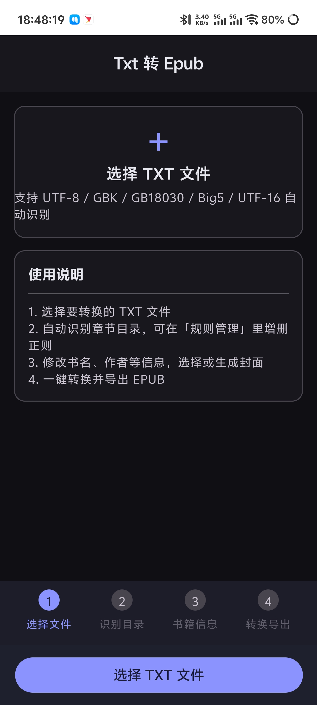
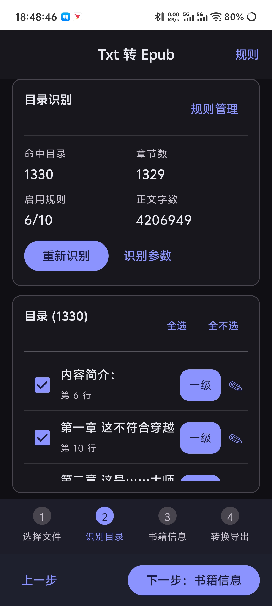
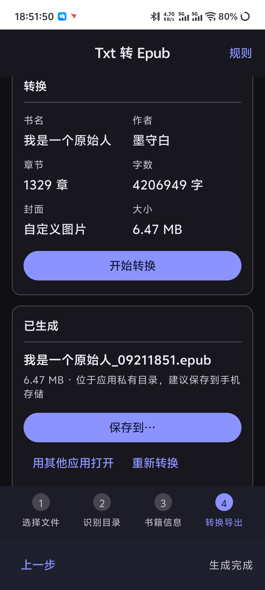

# Txt 转 Epub（Android）

[](LICENSE)

一个原生 Android App，把 TXT 小说转换成带目录的 EPUB 电子书。Kotlin + Jetpack Compose + Material 3，零第三方运行时依赖（EPUB 打包、编码识别、封面绘制全部自己实现）。

## 功能

| 功能 | 说明 |
| --- | --- |
| 选择 TXT | 通过系统文件选择器（SAF），也可用「用其他应用打开 TXT」直接进入 |
| 编码自动识别 | UTF-8 / UTF-16LE / UTF-16BE / GBK / GB18030 / Big5，含 BOM 判定；乱码时可手动切换 |
| 目录自动识别 | 内置 10 条中文小说常用规则（第X章、第X卷、第X节、楔子、番外、Chapter N…） |
| 自定义正则 | 可新增 / 编辑 / 禁用 / 删除规则，支持一级 / 二级目录；带「在当前文件中试一试」实时预览 |
| 目录可编辑 | 识别结果逐条列出，可改标题、改层级、取消勾选；支持识别参数微调 |
| 开头内容 | 第一个标题之前的内容（书名、作者、简介文字）单独做成「简介」章节，排在最前面 |
| 书籍信息 | 书名、作者、语言、出版方、简介 |
| 封面 | 8 套配色自动生成（渐变+排版），或从相册选图（自动 3:4 居中裁剪），也可不要封面 |
| 导出 | 生成标准 EPUB 3.0（同时输出 toc.ncx 兼容 EPUB2），可保存到任意位置或用其他应用打开 |

## 界面预览

| 选择文件 | 识别目录 |
| --- | --- |
|  |  |

| 书籍信息 | 转换导出 |
| --- | --- |
|  |  |

截图来自一部 420 万字长篇的实测：识别出 1329 章，转换后产出 6.47 MB 的 EPUB。

## 环境要求

- Android Studio Koala 或更新（或直接用命令行 Gradle）
- JDK 17
- Android SDK 34 / build-tools 34.0.0
- 最低支持 Android 8.0（API 26）

`local.properties` 需要指向本机 SDK：

```
sdk.dir=C:\\Android\\Sdk
```

## 构建

```bash
# 命令行（需要 JDK17）
gradlew.bat assembleDebug      # 输出 app/build/outputs/apk/debug/app-debug.apk
gradlew.bat :app:testDebugUnitTest   # 跑核心链路单元测试
```

或直接用 Android Studio 打开本目录，点 Run。

如果所在机器访问不了 `services.gradle.org`（Gradle 官方下载源），`gradlew` 会卡在下载发行包。
此时任选一种方式代替：

- `node build.js assembleDebug` —— 脚本直接调用本机已安装的 Gradle（路径写在脚本顶部，按需修改）
- 或手动把 `gradle/wrapper/gradle-wrapper.properties` 里的 `distributionUrl` 指向本地已下载的 `gradle-8.7-bin.zip`

## 目录结构

```
app/src/main/kotlin/com/txt2epub/app/
├── core/
│   ├── EncodingDetector.kt   编码识别
│   ├── ChapterRules.kt       内置正则规则库
│   ├── TocDetector.kt        目录扫描 + 章节切分
│   ├── EpubBuilder.kt        EPUB3 打包（mimetype/container/opf/ncx/nav/xhtml）
│   └── CoverGenerator.kt     封面自动生成与图片裁剪
├── model/Model.kt            数据模型
├── data/RuleStore.kt         规则持久化（DataStore）
├── vm/ConvertViewModel.kt    全流程状态机
└── ui/                       Compose 界面（四步向导）
```

## 内置目录规则

默认启用：第X卷、第X章/回、第X节、第X篇部集幕、英文 Chapter/Part、数字编号、序/楔子/后记/番外。
默认关闭（易误判，按需开启）：括号编号、中文数字编号、符号编号。

规则按顺序匹配，命中即停止。可在 App 内「规则管理」随时调整，自定义规则会自动保存。

## 测试

`app/src/test/kotlin/.../CorePipelineTest.kt` 用样例小说跑通全链路，并校验：

- 编码识别正确（含 GBK 样例）
- 目录命中与章节切分数量合理（不会把整本书压成一章）
- 产出的 epub 中 mimetype 存在且为 STORED（未压缩）、container.xml / content.opf / toc.ncx / nav.xhtml / 章节文件齐全

## 上传到 GitHub

先在 GitHub 上建一个空仓库（**不要**勾选初始化 README / .gitignore / LICENSE，本地已经有了），然后：

```bash
git remote add origin https://github.com/oneofperson/txt2epub.git
git push -u origin main
```

APK 建议作为 GitHub Release 的附件上传，不要提交进仓库（`.gitignore` 已排除 `*.apk`）。

## 许可证

MIT（见 [LICENSE](LICENSE)）。可以随意使用、修改、商用，只需保留版权声明。
